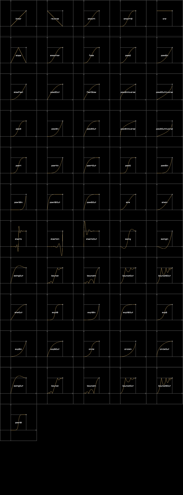

# Custom Cutscene Guide

##FOREWORD

- Though the cutscene script has to do with javascript, it isn't so hard.
- Of course, you need some grammar to make your journey easier, however the cutscene script is something that likes Lego Bricks. You just need to buffer code blocks one by one then you can maje cutscenes.
- So relax. **_You Can Do It_**

---

### Features

- Powered by **JavaScript**.
- Could be stored into the map file after you finish it, making it available without *external files*.
- Available for multiple-player games and servers.

### Caution

- Unsafe because the js don't have **_SECURITY LIMIT_**.
- Difficult to debug, as the crashes often occurred without a report, and the tools are still in develop period currently.
- While a map has both packaged script & external script file, only the packaged on will be run.

## HOW TO USE

### PRE IMPORTER

```js
Log.info("Loaded Cutscene Vault");

const loader = Vars.mods.getMod(modName).loader;

const loadClass = (fullName) => loader.loadClass(fullName).newInstance(); //Garbage things

const CutsceneScript = loadClass("newhorizon.feature.CutsceneScript");
const UIActions = loadClass("newhorizon.feature.CutsceneScript$UIActions");
const KeyFormat = loadClass("newhorizon.feature.CutsceneScript$KeyFormat");
const WorldActions = loadClass("newhorizon.feature.CutsceneScript$WorldActions");

const NHBlocks = loadClass("newhorizon.content.NHBlocks");
const NHBullets = loadClass("newhorizon.content.NHBullets");
const NHItems = loadClass("newhorizon.content.NHItems");
const NHLiquids = loadClass("newhorizon.content.NHLiquids");
const NHSounds = loadClass("newhorizon.content.NHSounds");
const NHWeathers = loadClass("newhorizon.content.NHWeathers");
const NHUnitTypes = loadClass("newhorizon.content.NHUnitTypes");
const NHStatusEffects = loadClass("newhorizon.content.NHStatusEffects");
const NHSectorPresets = loadClass("newhorizon.content.NHSectorPresets");
const NHFx = loadClass("newhorizon.content.NHFx");
const NHColor = loadClass("newhorizon.content.NHColor");
const NHPlanets = loadClass("newhorizon.content.NHPlanets");
const NHFunc = loadClass("newhorizon.func.NHFunc");
const DrawFunc = loadClass("newhorizon.func.DrawFunc");
const Tables = loadClass("newhorizon.func.Tables");
const TableFunc = loadClass("newhorizon.func.TableFunc");
const NHInterp = loadClass("newhorizon.func.NHInterp");
const PosLightning = loadClass("newhorizon.feature.PosLightning");

const OFFSET = 12, LEN = 60;

const state = Vars.state;
const tilesize = Vars.tilesize;
const world = Vars.world;
```

The way I used to import the `Class` is really garbage. If you are able to improve it, just **PULL REQUEST** .
Also, when your cutscene js is run by the mod, the line of the code is plussed the line number of the PRE IMPORTER.
> EG: 
> 
> You write ```WorldActions.raidFromCoreDefault(NHBulltes.airRaid, 10, 1, 120, 1)``` in the first line in your script file.
> 
> If something goes wrong at this line, the report will say `Line 36(35 + 1)` has problems

This importer has imported most of the MOD Classes that you will need. If you need more, you can invoke the method `loadClass(<String> Class Full Name);` to load more classes.

### Main Process

1. Write `(@HC)`, which means `Annotation: Has Cutscene`, in your map's name.
> Like this
> 
2. Save the map and open it.
3. The js file with a specific name will be automatically generated. If everything goes right, press `F8` to open the `last-log` and you will see this: 
4. Write your script in the file generated by the mod.
5. Go through the tough debugging time.
6. Open the `Menu` in `Map Editor` (Tap `ESC` on your keyboard or `Home Button` on your phone, or click the button on the dialog's left top), Click button `Cutscene Scripts`: 
7. Click button `Package Scripts`, then select the js file and confirm.
8. If you want to confirm, Click button `Read Scripts` to see whether the map has your script installed or not.
9. Save the map and the open the world, test your script.
10. If something wrong that didn't ever appear happens, try to repackage the script.
11. Publish your map.

### Core Method
```java

/**
 * Add ordered scripts. 
 *
 * @see DelayAction
 * @see ParallelAction
 * @see SequenceAction
 * @see RunnableAction
 * @see ImportantRunnableAction
 * @see LabelAction
 * @see CameraMoveAction
 * @see CameraTrackerAction
 * @see CautionAction
 *
 */
public static boolean actionSeq(Action... actions){
    boolean isPlaying = isPlayingCutscene;
    
    Action[] acts = new Action[actions.length + 1];
    System.arraycopy(actions, 0, acts, 0, actions.length);
    acts[acts.length - 1] = Actions.parallel(Actions.remove(), Actions.run(() -> currentActions = null));
    
    if(!isPlaying){
        isPlayingCutscene = true;
        currentActions = acts;
        Table filler = new Table(Tex.clear){
            {
                Core.scene.root.addChild(this);
                
                setFillParent(true);
                visible(UIActions::shown);
                
                keyDown(k -> {
                    if(k == KeyCode.escape) remove();
                });
            }
            
            @Override
            public void act(float delta){
                super.act(delta);
                if(Vars.state.isMenu()) remove();
            }
            
            @Override
            public boolean remove(){
                enableVanillaUI();
                
                if(waitingPool.any()){
                    Time.run(60f, () -> {
                        isPlayingCutscene = false;
                        actionSeq(waitingPool.pop());
                    });
                }else isPlayingCutscene = false;
                
                return super.remove();
            }
        };
        
        filler.actions(acts);
    }else{
        waitingPool.add(acts);
    }
    
    return isPlaying;
}
```

- Fill the method with `Action` one by on, follow time order.
- Cutscene is powered by `arc.scene.Action`.
- If you quit the world while a cutscene is playing, It won't be saved, which may causing some saving problems.
- If multiple actions are called overlapped, they will be acted one by one.

#### Caution
- All `Action`s' time are formatted into **Second** while other method are `tick(1 / 60 Sec)` format.
- Almost all methods uses **\*8** coordinates. 

### Commonly Used Fields & Methods

#### Interpolation: `Interp` & `NHInterp`


- You can get these from class `arc.math.Interp`, `newhorizon.func.NHInterp`.
- These are use as animation curves, which can adjust the progress of animations.
- If you activated the `Tool Panel` & `Debug Mod` in `Mod Settings`, you can access this table from *Cheat Table -> Debug -> Interp*.
---

#### Action: `arc.scene.Action`

- Originally used for UI animations. Now particular of them are usable in the cutscene scripts.
  - `DelayAction`
  - `ParallelAction`
  - `SequenceAction`
  - `RunnableAction`
  - `ImportantRunnableActi`
  - `LabelAction`
  - `CameraMoveAction`
  - `CameraTrackerAction`
  - `CautionAction`
  - `AddAction`
  - `AddListenerAction`
  - `RemoveListenerAction`
  - `AfterAction`
  - `IntAction`
  - `FloatAction`
  - `TimeScaleAction`
  - `RepeatAction`

--- 

#### Fields & Methods From Class: `CutsceneScript`

##### Actor Vault

```java
public static final Seq<Runnable> curUpdater = new Seq<>(), curIniter = new Seq<>();
public static final Seq<Cons<Boolean>> curEnder = new Seq<>();
```

- `curUpdater` Used to storage movements that is acted every update(Do not run during pause).
- `curIniter` Used to storage movements that is acted when the world is loaded.
- `curEnder` Used to storage movements that is acted when game over. Param `Boolean`: true -> win; false -> lose.

---

##### Block Destroy Listener

```java
public static final ObjectMap<Block, Cons<Building>> blockDestroyListener = new ObjectMap<>();
```

- Used to storage movements that will be called when a specific type of block is destroyed

---

##### Timer

```java
public static Interval timer = new Interval(6);
```

- Used for events that have short spacing.
- Use *Method:* `reload(...)` for events that have long time spacing and need to be saved.

---

##### Methods:

###### addListener(Seq<Block> types, Cons<Building> actor)
```java
public static void addListener(Seq\<Block> types, Cons<Building> actor){
    for(Block type : types)addListener(type, actor);
}
```
- Used for adding `Block Destroy Listener` for multiple block types at once

###### canInit()
```java
public static boolean canInit(){
    boolean b = !state.rules.tags.containsKey("inited") || !Boolean.parseBoolean(state.rules.tags.get("inited"));
    state.rules.tags.put("inited", "true");
    initHasRun = true;
    return b;
}
```
- Used for judging whether the mod hasn't running init cutscenes.
- Using it in a `if` statement, and write the initialization action in the following statement

###### eventHasData(String key)
```java
public static boolean eventHasData(String key){
    return state.rules.tags.containsKey(key);
}
```
- Used for checking whether an event has its data or not.
- Use it to know whether an event has happened or is going to happen.

###### run(String key, Boolf\<String> boolf, Runnable run)
```java
public static void run(String key, Boolf<String> boolf, Runnable run){
    if(state.rules.tags.containsKey(key) && boolf.get(state.rules.tags.get(key))){
        run.run();
    }
}
```
- Used for running an event when the data of the event is qualified.

###### getBool(String key)
```java
public static boolean getBool(String key){
    return state.rules.tags.containsKey(key) && Boolean.parseBoolean(state.rules.tags.get(key));
}
```
- Used for getting a `true` if an event's data equals `"true"`, or it will return `false`.

###### getFloat(String key)
```java
public static float getFloat(String key){
    return Float.parseFloat(state.rules.tags.get(key));
}
```
- Used for getting a `float` if an event's data if the string does not contain a parsable `float`, or it will throw an `Exception`.

###### getFloatOrNaN(String key)
```java
public static float getFloatOrNaN(String key){
    float f = Float.NaN;
    try{
        f = Float.parseFloat(state.rules.tags.get(key));
    }catch(Exception ignore){}
    return f;
}
```
- Used for getting a `float` if an event's data if the string does not contain a parsable `float`, or it will return `Float.NaN`.

~~Sorry I'm too tired, I may finish these in the future. Read `newhorizon.feature.CutsceneScript.java` instead~~

