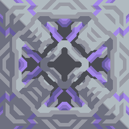
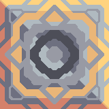
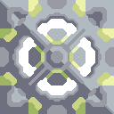
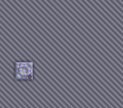
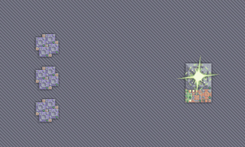

# NEWHORIZON MOD


****A Java Mindustry<V7> mod for Android and PC.****

**Powered by *Yuria*.**

## Community
[](https://discord.gg/yNmbMcuwyW)

## Server
`175.178.22.6:6666`

###### For non Chinese players:

First, you may need a __VPN__(virtual private network) to have a better experience, ~~because of that big fucking net wall around China.~~

A large quantity of the players speak Chinese
    
It may be hard to talk to those players. But some of those players can speak English, and are willing to translate for you, so don't lose hope.

Else, just because your frustrated doesnt make griefing okay. I believe every player can get along with one another ~~so long as no one blows up a reactor or breaks someone else's schematic~~.

Do invite your friends to try this mod, because you guys can use the amount of english speakers to turn the tables. ~~Also if the Chinese players don't quit, this could be a fantastic chance for them to learn English~~ (~~Maaaaaaaybeeeeeee~~). 

Have a nice day.

## Caution
**MOD DOES NOT SUPPORT _IOS_**

**If you are using a PC/laptop**, mod requires java installed, and maybe other versions (**_at least 8_**).

If you have git cloned this repository, simply install the mod in game.

Here are the `Requirements` override code, which I believe won't cause conflict between multiple mods. Nonetheless, I added a setting to disable the override.

```java
public class NHOverride{
    /*Override detail code...*/
    private static void addReq(Block target, ItemStack... items){
       ItemStack[] newReq = new ItemStack[items.length + target.requirements.length];
       
       System.arraycopy(target.requirements, 0, newReq, 0, target.requirements.length);
       System.arraycopy(items, 0, newReq, target.requirements.length, items.length);

       target.requirements = newReq;
       Arrays.sort(target.requirements, Structs.comparingInt((j) -> j.item.id));
    }

   private static void removeReq(Block target, Item... items){
      Seq<ItemStack> req = new Seq<>(ItemStack.class);
      req.addAll(target.requirements);

      for(Item item : items)req.each(itemReq -> itemReq.item == item, req::remove);

      target.requirements = req.shrink();
   }
}
```

## Custom Cutscene Script
[Get the information](https://github.com/Yuria-Shikibe/NewHorizonMod/wiki/Cutscene-Script-Custom-Guide)

## MOD Guide

### Block Guide

---
#### Scalable Turret & Upgrade Block

---

###### Example:

  
- **_Turret:_** End of Era

  
- **_Upgrader:_** End of Era Upgrader

###### Use Steps:
1. Click the `Upgrader`.
2. Click target turret, which must be `Scalable`.
   
   if everything goes correctly, you will see the link sign between the two buildings.
   
3. Click the `Upgrader`.
4. Click the button labeled `Upgrade`.
   if everything goes correctly, you will see the table of all the upgrade options.
5. Select the option you want to upgrade.
   
   
- Upgrading costs resources. The upgrader can take resources directly from the `Core`. ~~Nice and simple, right?~~
6. Make the turret function correctly just like other turrets.
---

#### Jump Gate

---




- **_JumpGate:_** Senior Jump Gate; Junior Jump Gate

###### Use Steps:
1. Click the building.
2. Click the `Spawn` button.
   Then you will see the spawn dialog.
   
3. Select the plus icon to summon the unit.
   
- Spawning units costs resources, which the jump gate can take directly from the `Core`.
- To place the `Senior Jump Gate`, the `Junior Jump Gate` is required as a base(you must place the senior jump gate over the junior jump gate).
- A new spawn system has been added since 1.7.8, which allows you to spawn specific units when a wave has passed. This also applys to enemies, so you guys can use it to make some interesting maps. 

---
#### Player Jump Gate

---

- **_PlayerJumpGate:_** Quickly transports a player from one position to another.

###### Use Steps:
1. Click the building.
2. Make sure the building isn't locked (You can switch the mode with the left button), then tap another `Player Jump Gate` to link.
3. Make sure you are using a flying unit. Get close to the building, then click the button `Teleport` to teleport to the linked building.

- Has cooldown time.
- Requires power to function. 
- Available in server.

---
#### Hyperspace Folding Gate & Gravity Trap

---



- **_Hyperspace Folding Gate:_** Transports a group of units from one side to another.

###### Use Steps:
1. Click the Hyperspace Folding Gate.
2. Click the `Select Destination` button, then click the screen. A cross will appear on the position you clicked. Click the cross again to set the destination.
3. Click the `Select Units` button, then click the screen. Drag the mouse or click the other diagonal point to select all friendly units within a rectangle. Click the button with the arrow icon below the select rectangle to confirm.
4. Click the `Transport Units` button.


- The jump could be intercepted by a `Gravity Trap Field` on it's **WAY TO THE DESTINATION(Not only the destination position will be affected)**, and the intercepted unit will receeive percentage damage. 
- Has cooldown time.
- Requires power and other items to function.
- Available in server.

---
#### Commandable Block

---


- **_Commandable Block:_** Active Defence Blocks.




###### Use Steps:
1. Click the Commandable Block.
2. Click the `Select Destination` button, then click the screen. A cross will appear on the position you clicked. Click the cross again to set the destination.
3. Click the `Up Open` button, Corresponding blocks of the same kind will make feedback actions.

- Has cooldown time.
- Requires power and other items to function.
- Available in the server.

