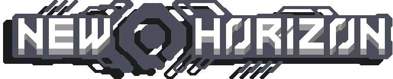
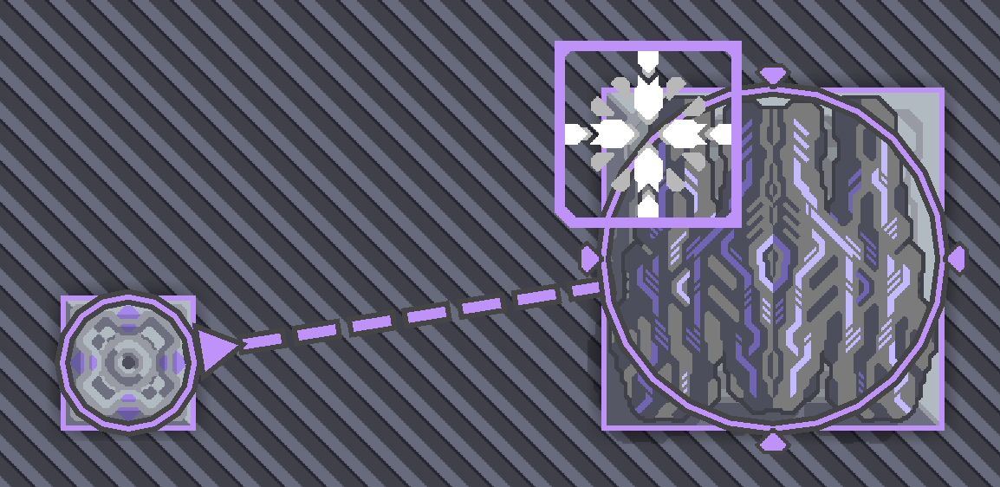
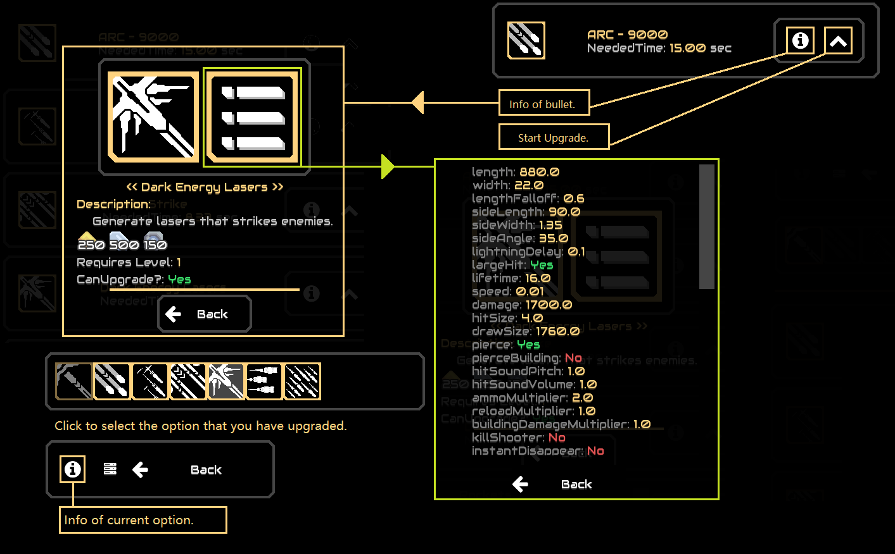
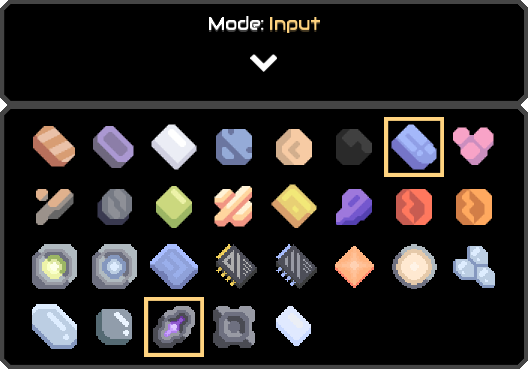
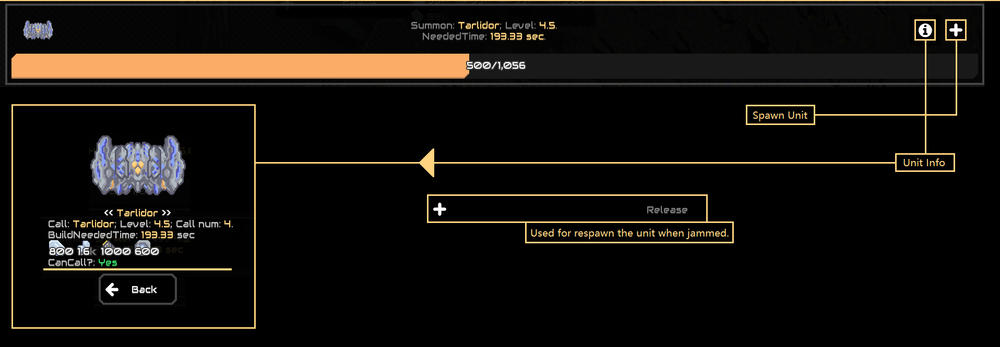

# NEWHORIZON MOD

****A Java Mindustry mod for Android and PC.****

**Powered by *Yuria*.**

## Update Frequency
During this term (from March to June) I can only update this mod on weekends.

## Community

## Server
`mindustry.xyz:10704`

###### For foreigners (foreign countries relative to China)

Most of the players in the server may speak Chinese when you log in.

Well, you may feel it is impossible to communicate with them because as I know, many of the players in the Chinese Mindustry community (especially in my place) do not use English often or are not fluent in it ~~just like me~~. However, I believe there must be players who are good at English that are willing to translate what you say to others, then translate what is replied to you.

But if that doesn't happen, making everything function right and not demolishing buildings at will are enough. I believe every player can get along well with one another ~~as long as no one blows up a reactor or breaks someone else's blueprint~~.

Don't forget to invite your friends to try this mod, because you guys can use the amount of non-Chinese speaking players to turn the situation. ~~Also if Chinese players don't quit, this may be a fantastic chance for them to learn English~~ (~~Maaaaaaaybeeeeeee~~). 

Have a nice day.

## Caution
**MOD DOES NOT SUPPORT _IOS_**

**If you are using a PC**, mod requires `jdk 14` installed, or maybe other versions of jdk (**_at least 8_**).

If you downloaded from `Action`, unzip the Mod.zip file first, then install the mod in-game;

Mod is ***unstable*** (mainly for phones, which have some UI and loading problems) and is ***WORK IN PROGRESS***.

All code is here and completely open source ~~so no code that has *safety* problems could be hidden~~.

## In Game Settings
This mod adds a new setting dialog when starting the game.
By choose the available setting, you can activate the in-game debug panel and advance load, which creates outline icons and unit full icons automatically.
However, the advance load now causes a stuck problem when the game is loaded on a phone. So, for your gaming experience, I made it false by default. If you are confident with your device, activate it.
If you find that your device cannot afford it, open the mod file folder and find the "new-horizon" folder. Then, open the properties file in it, change the "@active.advance-load*" to false, and open the game again.

**However, when the mod is deleted, the setting file will not be deleted automatically, so before I solve this problem, you may have to delete it yourself.**

## MOD Guide

### Block Guide

---
#### Scalable Turret & Upgrade Block

---

###### Example:

  
- **_Turret:_** End of Era

  
- **_Upgrader:_** End of Era Upgrader

###### Use Steps:
1. Click the `Upgrader`.
2. Click target turret, which must be `Scalable`.
   
   if everything goes correctly, you will see the link sign between the two buildings.
   
3. Click the `Upgrader`.
4. Click button `Upgrade`.
   if if everything goes correctly, you will see the table of all the upgrade options.
5. Select the option you want to upgrade.
   
   
- Upgrades needs resources. The upgrader can take resources directly from the `Core`. ~~Nice and simple, right?~~
6. Make the turret function correctly just like other turrets.
---
#### Mass Deliverer

---

- **_Deliverer:_** Mass Deliverer

###### Use Steps:
1. Click the building.
2. Select the mode `input` or `output`.
   If `input`, choose the item you want to take on the table.
   
   You can choose multiple items at the same time.
   
   
3. Select the target just like with a `Mass Driver`.

---
#### Jump Gate

---

- **_JumpGate:_** Senior Jump Gate; Junior Jump Gate

###### Use Steps:
1. Click the building.
2. Click the `Spawn` button.
   Then you will see the spawn dialog.
   
3. Select the plus icon to summon the unit.
   
- Spawning units requires resource, which the jump gate can take the resource directly from the `Core`.
- To place the `Senior Jump Gate`, the `Junior Jump Gate` is required as a base.

---
#### Player Jump Gate

---

- **_PlayerJumpGate:_** Quickly transports a player from one position to another.

###### Use Steps:
1. Click the building.
2. Make sure the building isn't locked (You can get and switch the mode through the left button), then tap another `Player Jump Gate` to link.
3. Make sure you are using a flying unit. Get close to the building, then click the button `Teleport` to teleport to the linked building.

- Has cooldown time.
- Requires power to function. 
- Available in the server.
---
#### Hyperspace Folding Gate & Gravity Gully

---

- **_Hyperspace Folding Gate:_** Transports a group of units from one side to another.

###### Use Steps:
1. Click the Hyperspace Folding Gate.
2. Click the `Select Destination` button, then click the screen. A cross will appear on the position you clicked. Click the cross again to set the destination.
3. Click the `Select Units` button, then click the screen. Drag the mouse or click the other diagonal point to select all friendly units within a rectangle. Click the button with the arrow icon below the select rectangle to confirm.
4. Click the `Transport Units` button.

- Has cooldown time.
- Requires power and other items to function.
- Available in the server.

