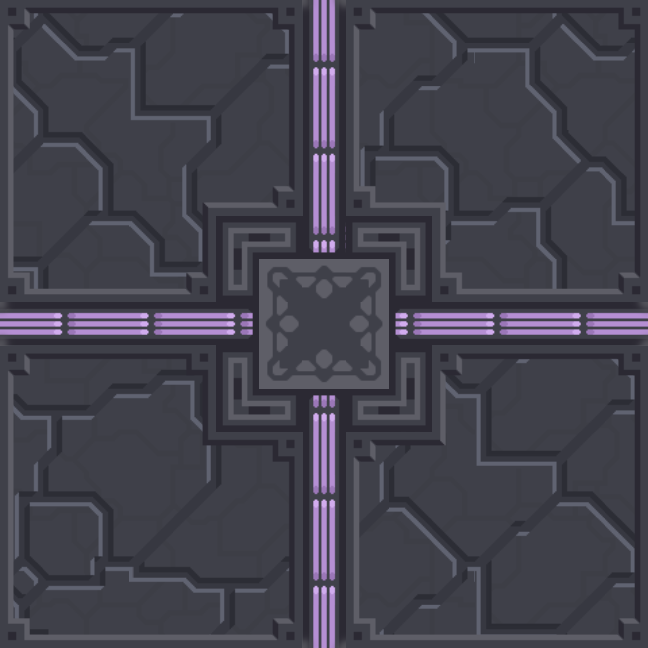
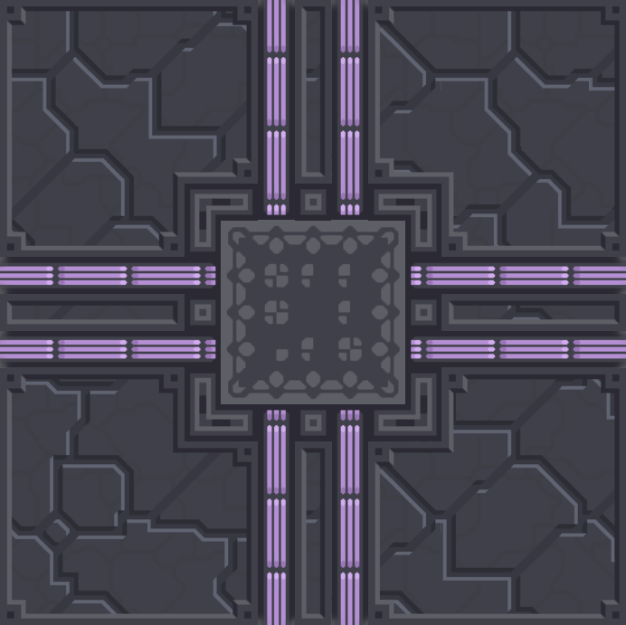
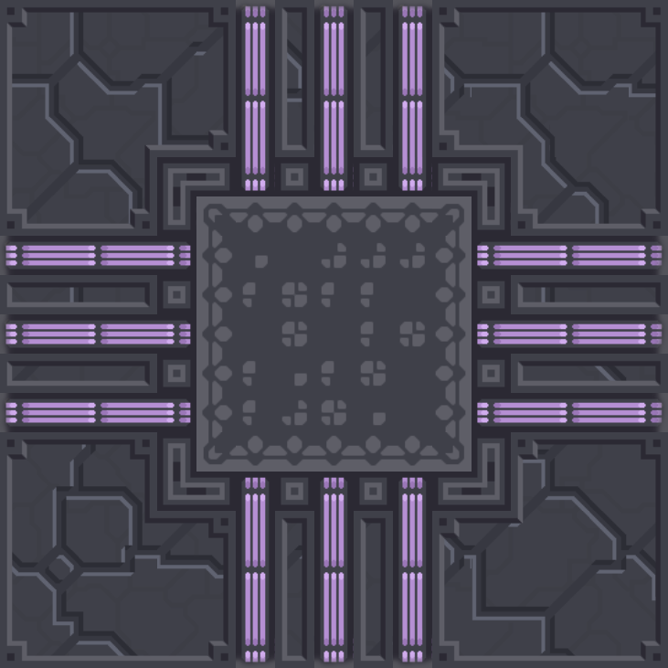

## 机制描述：

- 路径在制图时预设，使用标识性质的地板划分：核心区/炮塔区/单位区/特殊区等
- 所有的建筑只使用特殊流体资源，所有的建筑均可以传导液体（传导速度较慢且建筑之间运输流体液压差的阈值较高）
- 暂定液体: 钷介素(Plo-Naq) 卡离子(Kar-Ion) 铬态能(Cho-vat) (没啥别的意思，单纯好听)

## 建筑：
- 核心(3x3) 
- 核心(5x5) 
- 核心(7x7) 
- 输出点可考虑修改，上述仅作展示用，连接贴图未定，不太好做

flood建筑特殊字段：

所用液体：
钷介素(Plo-Naq)：临界状态胶体。可按需求自由构造为任何高强度建筑或，或对受损建筑进行快速修复。
铬态能(Cho-Vat)：呈铬绿色的流态能量。通过放能效应显著降低来袭火力的伤害。
卡离子(Kar-Ion)：六维高维释能离子。对常规维度物体通过解离以进行毁灭性打击。

钷介素容量：扩展和扛伤为目的的建筑容量较高
铬态能容量：扛伤为目的的建筑容量较高，输出类单位较低
卡离子容量：输出类建筑较高，其他建筑较低。炮塔开火/单位制造时会消耗液体

回血效率：单位液体所回血量，10回血效率代表1单位液体回10血
回血速度：建筑受到伤害时，每秒消耗钷介素的数量
减伤效率：受到单位伤害所削减的减伤液体数，100效率代表受到100实际伤害只扣1液体
减伤强度：铬态能满溢时，建筑的减伤强度。建筑减伤强度与液体/容量的开方为正比
    0.4的减伤倍率即液体含量为0.16容量，0.8的为0.64
    80%的减伤强度意味着有36/100的液体时，实际减伤强度为48%
辐能倍率：卡离子容量满时，伤害/速度的倍率。倍率与液体/容量为正比
构造阈值：建筑使用钷介素构造所需要的最低液体量。

液体可来源于各核心，各种活动均与上述三种液体相关，
亦可添加各种特殊建筑，进行液体的储存或生产，如矿变液体，储存液体保障炮塔输出，或消耗液体辅助回血等
看着办，反正所有内容应均与三种液体息息相关
